# ShopWave 🛒

> A production-ready Flutter e-commerce application built with Clean Architecture, Riverpod, and Supabase.

[](https://flutter.dev)
[](https://dart.dev)
[](LICENSE)

---

## 📱 App Screenshots / لقطات من التطبيق

<p align="center">
  <table align="center">
    <tr>
      <td align="center">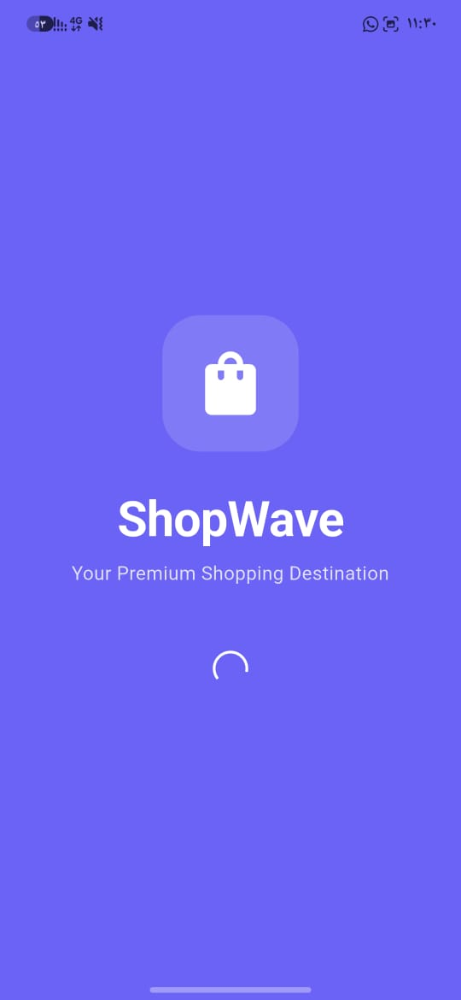<br><sub>Splash & Welcome</sub></td>
      <td align="center">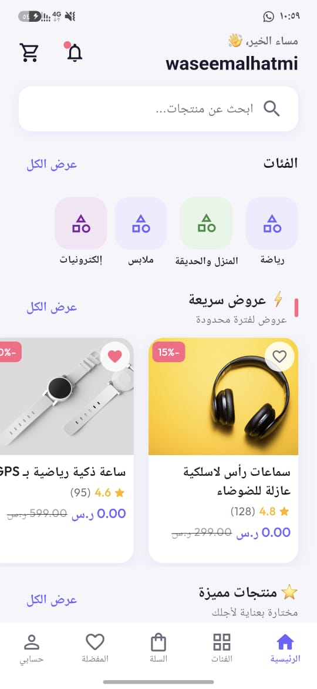<br><sub>Login & Authentication</sub></td>
      <td align="center">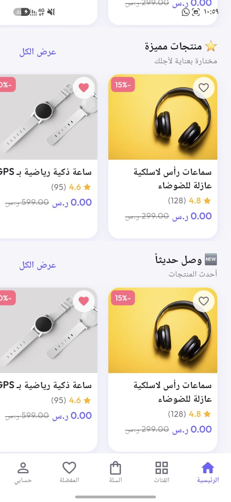<br><sub>Home Page (English)</sub></td>
      <td align="center">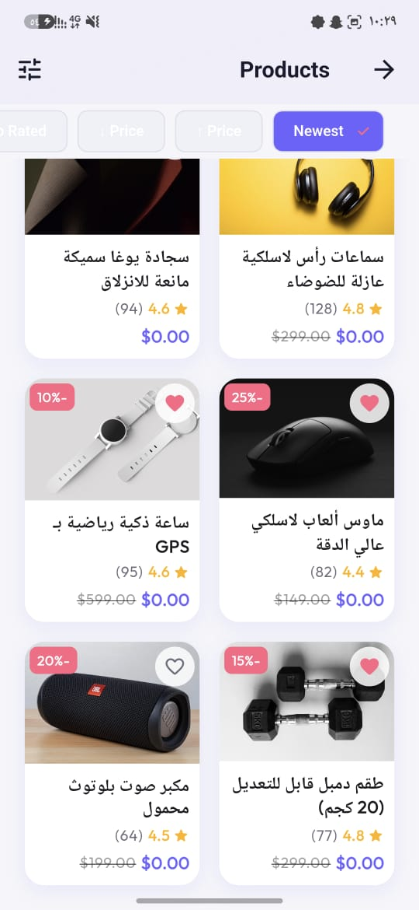<br><sub>Home Page (Arabic)</sub></td>
    </tr>
    <tr>
      <td align="center">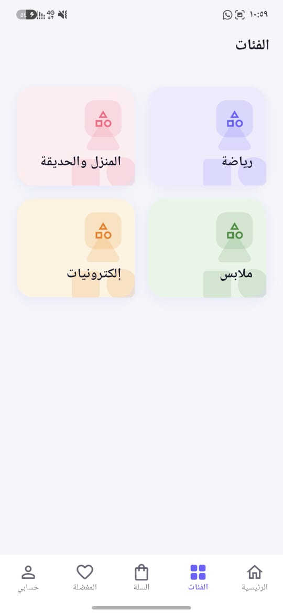<br><sub>Categories (Arabic)</sub></td>
      <td align="center">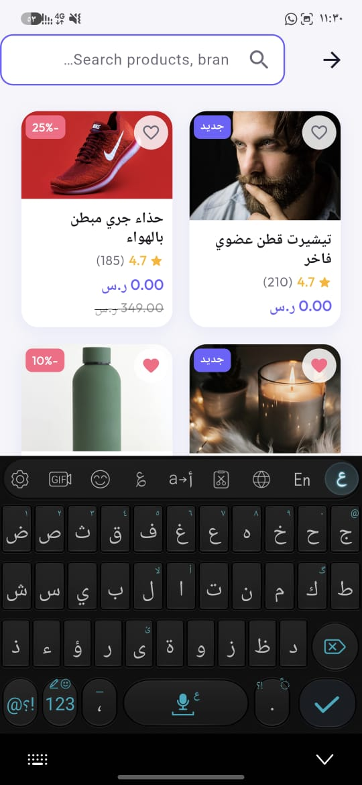<br><sub>Product List</sub></td>
      <td align="center">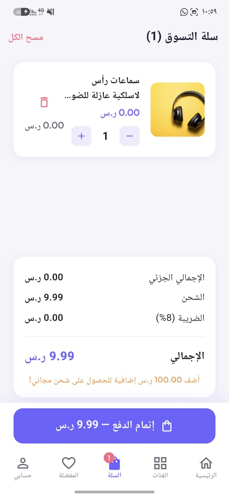<br><sub>Product Detail</sub></td>
      <td align="center">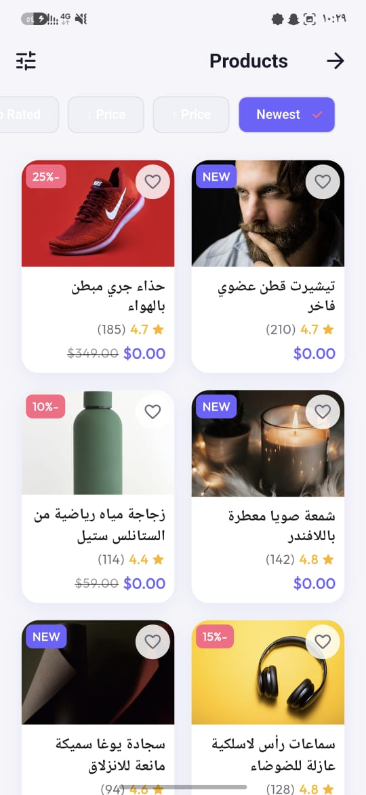<br><sub>Shopping Cart (Arabic)</sub></td>
    </tr>
    <tr>
      <td align="center">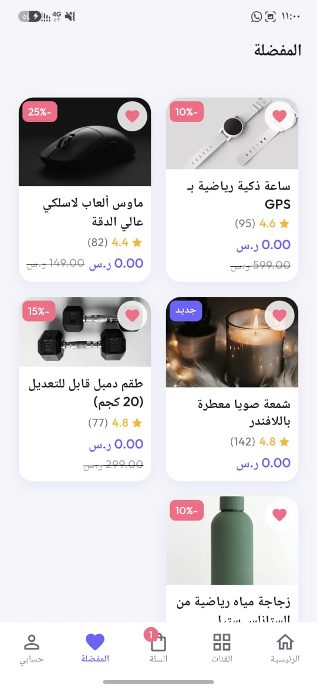<br><sub>Favorites & Wishlist</sub></td>
      <td align="center">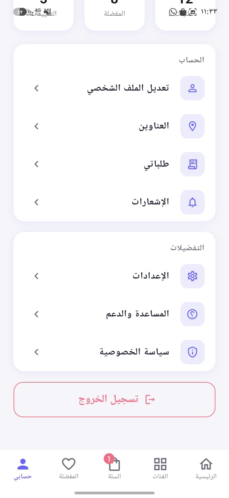<br><sub>User Profile (Arabic)</sub></td>
      <td align="center">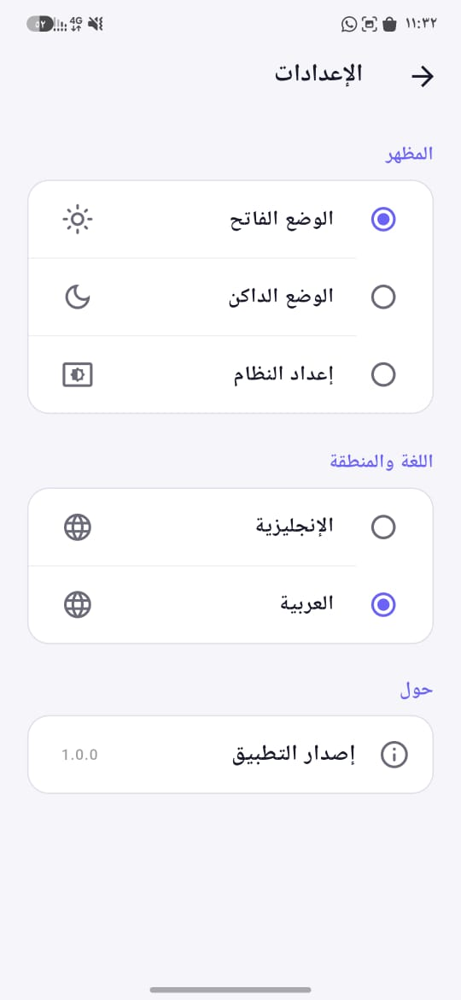<br><sub>Theme & Language Settings</sub></td>
      <td align="center">-</td>
    </tr>
  </table>
</p>

---

## ✨ Features

- 🛍️ Complete shopping experience (browse → cart → checkout → track)
- 🌍 Bilingual: Arabic (RTL) + English (LTR)
- 🌙 Dark & Light theme with Material 3
- 🔒 Secure: Supabase Auth + RLS policies
- 📱 Android & iOS from a single codebase
- ⚡ Skeleton loading, offline caching, pagination

---

## 🏗️ Architecture

```
Feature-First Clean Architecture
├── Presentation (Screens, Notifiers, Widgets)
├── Domain (Entities, Use Cases, Repository Interfaces)
└── Data (Repository Impls, Data Sources, DTOs)
```

State Management: **Riverpod 2.x** with code generation  
Navigation: **GoRouter** with ShellRoute  
Backend: **Supabase** (PostgreSQL + Auth + Storage + Realtime)

---

## 🚀 Getting Started

### Prerequisites
- Flutter SDK 3.38.1+
- Dart SDK 3.10.0+
- A Supabase project

### 1. Clone the repository
```bash
git clone https://github.com/your-org/shop_wave.git
cd shop_wave
```

### 2. Set up environment variables
```bash
cp .env.example .env
# Edit .env with your Supabase credentials
```

### 3. Set up the database
```sql
-- Run supabase/schema.sql in your Supabase SQL Editor
```

### 4. Install dependencies
```bash
flutter pub get
```

### 5. Generate code (Riverpod, Freezed, JSON)
```bash
dart run build_runner build --delete-conflicting-outputs
```

### 6. Generate localizations
```bash
flutter gen-l10n
```

### 7. Run the app
```bash
flutter run --dart-define-from-file=.env
```

---

## 📁 Project Structure

```
lib/
├── core/              # Shared infrastructure
│   ├── config/        # App + Supabase config
│   ├── di/            # Riverpod providers (DI)
│   ├── error/         # Failures + Exceptions
│   ├── extensions/    # BuildContext, String, Num, DateTime
│   ├── l10n/          # ARB files (EN + AR)
│   ├── router/        # GoRouter + Routes
│   ├── theme/         # Colors, Typography, Spacing
│   ├── utils/         # Logger, Validators
│   └── widgets/       # Shared widgets
└── features/
    ├── auth/          # Splash, Onboarding, Login, Register
    ├── home/          # Home screen
    ├── products/      # Product list, Detail, Search
    ├── categories/    # Category browsing
    ├── cart/          # Shopping cart
    ├── checkout/      # Checkout flow
    ├── orders/        # Order history & tracking
    ├── favorites/     # Wishlist
    ├── profile/       # User profile
    ├── addresses/     # Address management
    ├── notifications/ # Notification center
    └── settings/      # App settings
```

---

## 📊 Development Phases

| Phase | Status | Description |
|-------|--------|-------------|
| Phase 1 | ✅ Complete | Foundation & Infrastructure |
| Phase 2 | 🔜 Next | Authentication Flow |
| Phase 3 | ⏳ Planned | Home & Product Catalog |
| Phase 4 | ⏳ Planned | Product Detail & Reviews |
| Phase 5 | ⏳ Planned | Cart & Favorites |
| Phase 6 | ⏳ Planned | Checkout & Orders |
| Phase 7 | ⏳ Planned | Profile & Settings |
| Phase 8 | ⏳ Planned | Polish, Testing & Launch |

---

## 🧪 Running Tests

```bash
flutter test
```

---

## 📖 Documentation

- [Software Design Document](./SOFTWARE_DESIGN_DOCUMENT.md)
- [Project Roadmap](./ROADMAP.md)
- [Database Schema](./supabase/schema.sql)

---

## 📝 Commit Convention

We use [Conventional Commits](https://www.conventionalcommits.org/):

```
feat(auth): add Google OAuth login
fix(cart): prevent negative quantity
chore(deps): upgrade riverpod
refactor(products): extract ProductCard widget
test(auth): add login use case unit test
```

---

## 🔐 Environment Variables

| Variable | Description |
|----------|-------------|
| `SUPABASE_URL` | Your Supabase project URL |
| `SUPABASE_ANON_KEY` | Your Supabase anonymous key |
| `APP_ENV` | `development` or `production` |

---

*Built with ❤️ using Flutter + Supabase*
